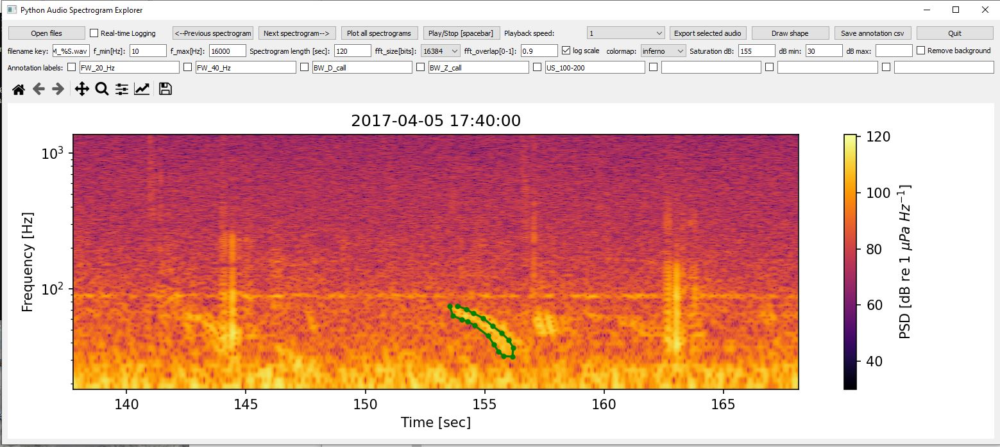
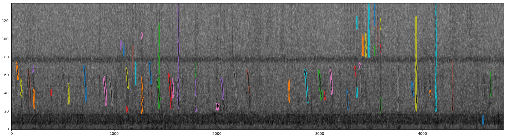
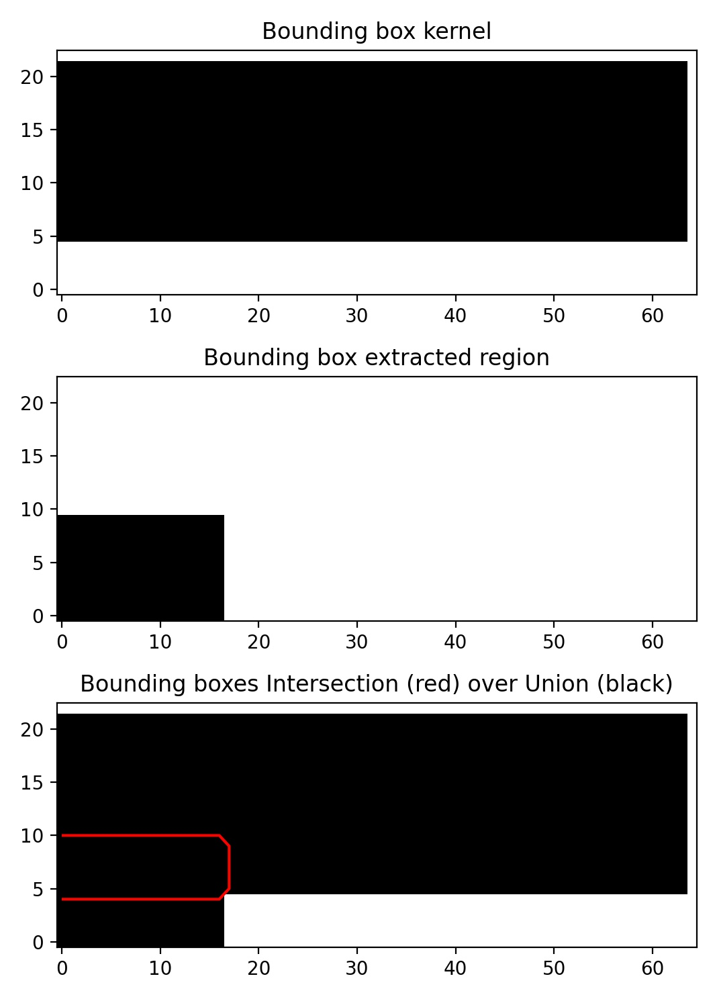
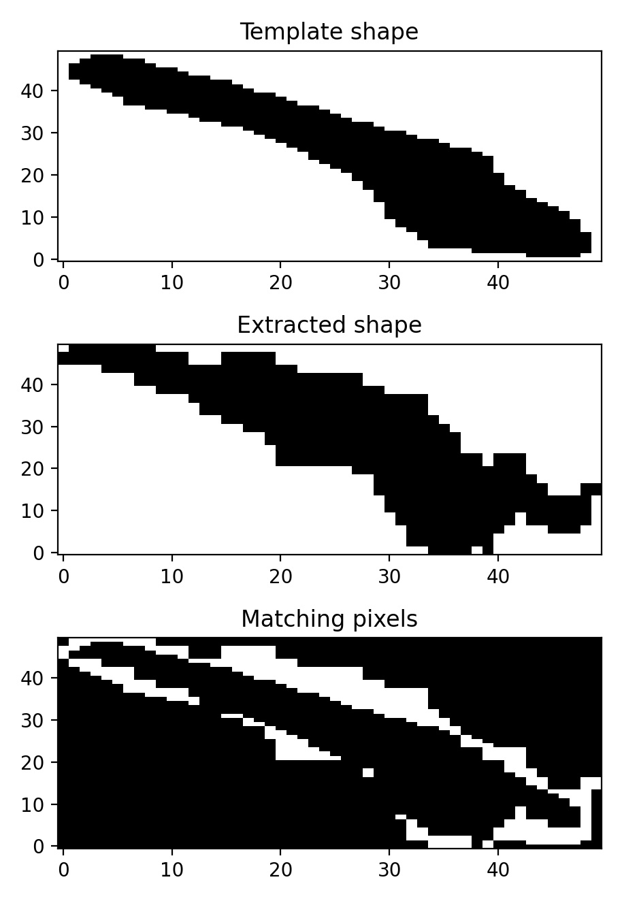
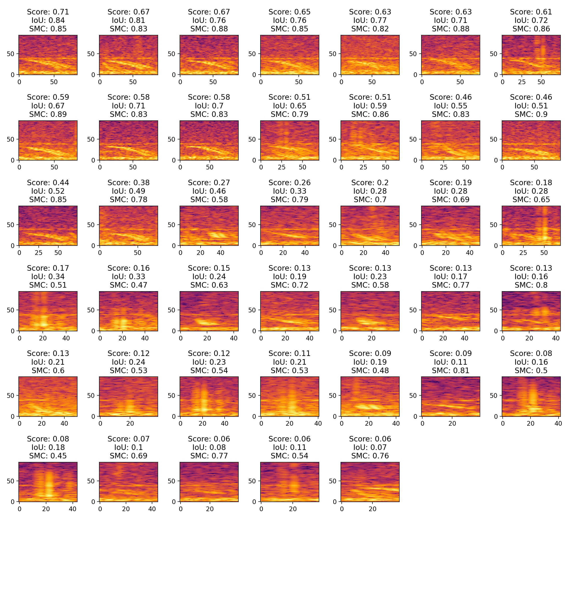
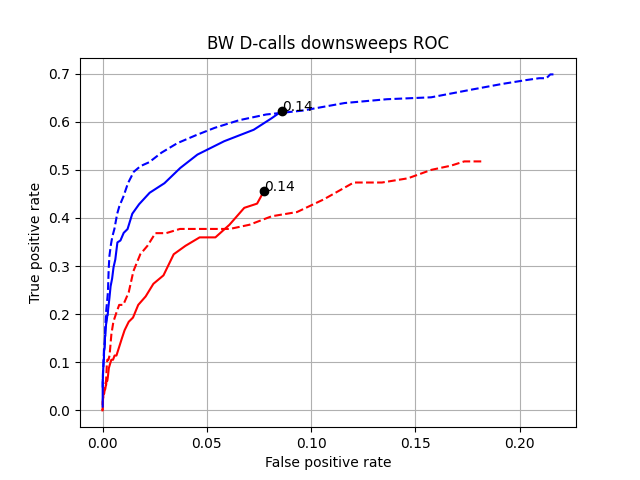
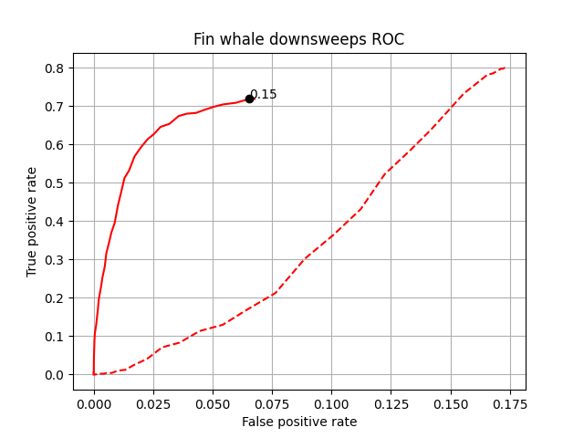
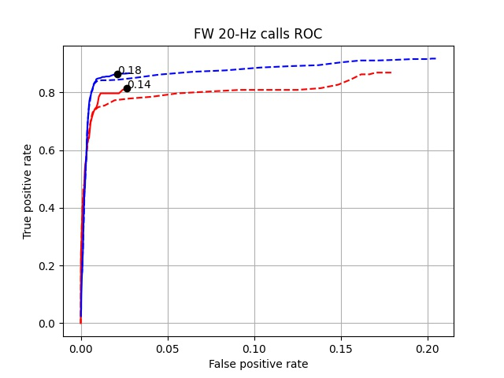
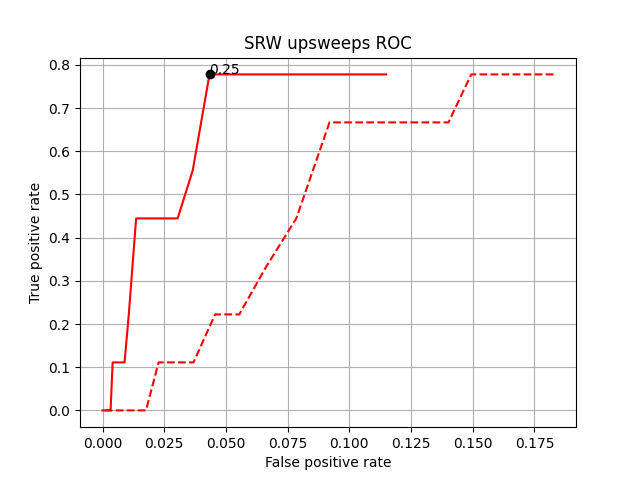

# Marine mammal call detection using spectrogram shape-matching

This signal deception algorithm was developed to automatically detected marine mammals calls in a large set of underwater sound recordings. A 5% subset of the recordings was screened manually to annotate marine mammals calls and test the detector performance. I used spectrogram correlation to detect some calls, but found that it only works well for complex signals such as Blue whale Z-calls, and produces many false positives for simpler signals such as Fin whale downsweeps and Blue whale D-calls. I thus developed this algorithm. It extracts regions of interest (ROIs) from the spectrogram and compares them to a given shape. Here is how it works:

## 1. Generate a template shape from an example signal

I used the "Python Audio Spectrogram Explorer" (https://github.com/sebastianmenze/Python-Audio-Spectrogram-Explorer) to find and draw the shape of the signal I am searching. Here is an example for Blue whale D-call. I export the template as time and frequency table. 



## 2. Clean the spectrogram and extract patches

I am using image processing tools  (https://scikit-image.org/) to extract relevant signals and shapes from the spectrogram. At first we need to remove the acoustic background by subtracting averaged spectra (i used 3 min averages here). Than we need to clean the spectrogram by removing small matches and closing the holes in larger patches. For this we are using a combination of filters called dilation and erosion (https://scikit-image.org/docs/dev/auto_examples/applications/plot_morphology.html#sphx-glr-auto-examples-applications-plot-morphology-py). 

Then I set a threshold (I used 10 dB, but try different threshold!) to generate a binary spectrogram the is 0 where no signal is present and 1 where a signal is present. Now a labeling algorithm can pick out all the different patches and we can extract each patches bounding box, intensity and other parameters. Here is what the full function looks like, including the necessary packages: 

```python
import pandas as pd
import numpy as np
import matplotlib.pyplot as plt
import datetime as dt
import glob 
import os
from matplotlib.path import Path

from scipy.io import wavfile
from scipy import signal
from skimage.transform import rescale, resize, downscale_local_mean

from skimage import data, filters, measure, morphology
from skimage.morphology import (erosion, dilation, opening, closing,  # noqa
                                white_tophat)
from skimage.morphology import disk  # noqa

def find_regions(audiopath,f_lim,fft_size,db_threshold,minimum_patcharea,startlabel):
    
    # audiopath=r"D:\passive_acoustics\detector_delevopment\pitchtrack\aural_2017_04_05_17_40_00.wav"
    starttime= dt.datetime.strptime( audiopath.split('\\')[-1], 'aural_%Y_%m_%d_%H_%M_%S.wav' )
   
    fs, x = wavfile.read(audiopath)

    # fft_size=2**14
    f, t, Sxx = signal.spectrogram(x, fs, window='hamming',nperseg=fft_size,noverlap=0.9*fft_size)
    
    # f_lim=[10,200]
    # db_threshold=10
    # minimum_patcharea=5*5
    # startlabel=0
    
    ix_f=np.where((f>=f_lim[0]) & (f<=f_lim[1]))[0]
    spectrog = 10*np.log10(Sxx[ ix_f[0]:ix_f[-1],: ] )   
    
    # filter out background
    rectime= pd.to_timedelta( t ,'s')
    spg=pd.DataFrame(np.transpose(spectrog),index=rectime)
    bg=spg.resample('3min').mean().copy()
    bg=bg.resample('1s').interpolate(method='time')
    bg=    bg.reindex(rectime,method='nearest')
    
    background=np.transpose(bg.values)   
    z=spectrog-background
   
    # plt.figure(1)
    # plt.clf()
    # plt.subplot(211)
    # plt.imshow(background,aspect='auto',origin='lower')
    # plt.subplot(212)
    # plt.imshow(z,aspect='auto',origin='lower')
    # plt.clim([10,z.max()])

    
    # Binary image, post-process the binary mask and compute labels
    mask = z > db_threshold
    mask = morphology.remove_small_objects(mask, 50,connectivity=30)
    mask = morphology.remove_small_holes(mask, 50,connectivity=30)
    
    mask = closing(mask,  disk(3) )
    # op_and_clo = opening(closed,  disk(1) )
    
    labels = measure.label(mask)
      
    probs=measure.regionprops_table(labels,spectrog,properties=['label','area','mean_intensity','orientation','major_axis_length','minor_axis_length','weighted_centroid','bbox'])
    df=pd.DataFrame(probs)
    
    # # plot spectrogram and shapes
    # plt.figure(1)
    # plt.clf()
    # plt.imshow(z,aspect='auto',origin='lower',cmap='gist_yarg')
    # plt.clim([0,20])
    # for index in range(len(df)):
    #     label_i = df.loc[index,'label']
    #     contour = measure.find_contours(labels == label_i, 0.5)[0]
    #     y, x = contour.T
    #     plt.plot(x,y)    
            
    # get corect f anf t
    ff=f[ ix_f[0]:ix_f[-1] ]
    ix=df['bbox-0']>len(ff)-1
    df.loc[ix,'bbox-0']=len(ff)-1
    ix=df['bbox-2']>len(ff)-1
    df.loc[ix,'bbox-2']=len(ff)-1
    
    df['f-1']=ff[df['bbox-0']] 
    df['f-2']=ff[df['bbox-2']] 
    df['f-width']=df['f-2']-df['f-1']
    
    ix=df['bbox-1']>len(t)-1
    df.loc[ix,'bbox-1']=len(t)-1
    ix=df['bbox-3']>len(t)-1
    df.loc[ix,'bbox-3']=len(t)-1
    
    df['t-1']=t[df['bbox-1']] 
    df['t-2']=t[df['bbox-3']] 
    df['duration']=df['t-2']-df['t-1']
        
    tt=df['t-1']
    df['realtime']=starttime + pd.to_timedelta( tt ,'s')
    
    indices=np.where( (df['area']<minimum_patcharea) | (df['bbox-3']-df['bbox-1']<3)  )[0]
    df=df.drop(indices)
    df=df.reset_index()    
    
    df['id']= startlabel + np.arange(len(df))
    df['filename']=audiopath     
    
    # get region dict
    sgram={}
    patches={}
    p_t_dict={}
    p_f_dict={}
    
    for ix in range(len(df)):
        m=labels== df.loc[ix,'label']
        ix1=df.loc[ix,'bbox-1']
        ix2=df.loc[ix,'bbox-3']
        jx1=df.loc[ix,'bbox-0']
        jx2=df.loc[ix,'bbox-2'] 
    
        patch=m[jx1:jx2,ix1:ix2]
        pt=t[ix1:ix2]
        pt=pt-pt[0]     
        pf=ff[jx1:jx2]
        
        # contour = measure.find_contours(m, 0.5)[0]
        # y, x = contour.T
                   
        patches[ df['id'][ix]  ] = patch
        p_t_dict[ df['id'][ix]  ] = pt
        p_f_dict[ df['id'][ix]  ] = pf
           
        ix1=ix1-10
        if ix1<=0: ix1=0
        ix2=ix2+10
        if ix2>=spectrog.shape[1]: ix2=spectrog.shape[1]-1       
        sgram[ df['id'][ix]  ] = spectrog[:,ix1:ix2]

    return df, patches,p_t_dict,p_f_dict ,sgram
```

For the example recording "aural_2017_04_05_17_40_00.wav" the extracted patches are shown below. Note the the recording contains both D-calls and the very similar but shorter Fin whale down-sweep calls.



## 3. Compare the patches to our template shape

Now we need to compare each patch to our template. For this, I calculate two measures of similarity. One is the "Intersection over Union" (IoU) between the templates bounding box and patch bounding box. This gives us a values between 0 and 1, where 0 means our signal is not within the frequency range and duration range and 1 means we have a perfect match. Here is an example visualization for a badly fitting bounding box:



The second similarity measure is how well the extracted shape fits to our template shape. Therefore I rescale both patches to the same n*n size and then calculate the "Simple matching coefficient" (SMC) = Matching pixes / Number of pixels. This again gives me a values between 0 and 1. Where 0 means the shape is inverted (black is white), 0.5 is random noise and 1 means a perfect match.

Here is an example for a patch the fits well to the template shape:



Now I can calculate a classification score by multiplying the SMC (rescaled between 0 (noise) and 1(perfect match)) and IoU values:

score = IoU * (SMC-.5)/.5

The score will be 0 for patches that are in a different frequency and time range than our template and increase the more similar the shape and time-frequency range of the patch are. The full shape matching functions looks like this:

```python
def match_shape(df, patches ,p_t_dict,p_f_dict ,shape_t, shape_f,shape_label):
    # kernel_csv=r"D:\passive_acoustics\detector_delevopment\specgram_corr\kernel_dcall.csv"
    # df_shape=pd.read_csv(kernel_csv,index_col=0)
    # shape_t=df_shape['Timestamp'].values - df_shape['Timestamp'].min()
    # shape_f=df_shape['Frequency'].values
    # shape_label='dcall'
      
    df.index=df['id']    

    score_smc=[]
    score_ioubox=[] 
    smc_rs=[]

    for ix in df['id'].values:   
        
        # breakpoint()
        patch=patches[ix]
        pf=p_f_dict[ix]
        pt=p_t_dict[ix]
        pt=pt-pt[0]
        
        
        if df.loc[ix,'f-1'] < shape_f.min():
            f1= df.loc[ix,'f-1'] 
        else:
            f1= shape_f.min()
        if df.loc[ix,'f-2'] > shape_f.max():
            f2= df.loc[ix,'f-2'] 
        else:
            f2= shape_f.max()      
            
        # f_lim=[ f1,f2  ]
                
        time_step=np.diff(pt)[0]
        f_step=np.diff(pf)[0]
        k_f=np.arange(f1,f2,f_step )
        
        if pt.max()>shape_t.max():
            k_t=pt
            # k_t=np.arange(0,pt.max(),time_step)

        else:
            k_t=np.arange(0,shape_t.max(),time_step)
            # k_length_seconds=shape_t.max()
            # k_t=np.linspace(0,k_length_seconds,int(np.ceil(k_length_seconds/time_step)) )
    
            
        # generate kernel  
        # ix_f=np.where((p_f>=f_lim[0]) & (p_f<=f_lim[1]))[0]
        # k_f=p_f[ix_f[0]:ix_f[-1]]
        # k_f=np.linspace(f_lim[0],f_lim[1], int( (f_lim[1]-f_lim[0]) /f_step)  )
        
        kk_t,kk_f=np.meshgrid(k_t,k_f)   
        kernel=np.zeros( [ k_f.shape[0] ,k_t.shape[0] ] ) 
        
        x, y = kk_t.flatten(), kk_f.flatten()
        points = np.vstack((x,y)).T 
        p = Path(list(zip(shape_t, shape_f))) # make a polygon
        grid = p.contains_points(points)
        mask = grid.reshape(kk_t.shape) # now you have a mask with points inside a polygon  
        kernel[mask]=1
        
        patch_comp=np.zeros( [ k_f.shape[0] ,k_t.shape[0] ] ) 
        
        # ixp2=np.where((k_t>=pt[0])  & (k_t<=pt[-1]))[0]     
        # ixp1=np.where((k_f>=pf[0])  & (k_f<=pf[-1]))[0]
        
        
        ixp_f=np.where(k_f>=pf[0])[0][0]
                               
        patch_comp[ixp_f:ixp_f+len(pf) , 0:len(pt) ]=patch
        
          
        smc =  np.sum( patch_comp.astype('bool') == kernel.astype('bool') ) /  len( patch_comp.flatten() )
        score_smc.append(smc )

        # shift, error, diffphase = phase_cross_correlation(patch_comp, kernel)
        # score_rms.append(error )
      
        ### iou bounding box
        
        iou_kernel=np.zeros( [ k_f.shape[0] ,k_t.shape[0] ] ) 
        ixp2=np.where((k_t>=shape_t.min())  & (k_t<=shape_t.max()))[0]     
        ixp1=np.where((k_f>=shape_f.min())  & (k_f<=shape_f.max()))[0]     
        iou_kernel[ ixp1[0]:ixp1[-1] , ixp2[0]:ixp2[-1] ]=1

        iou_patch=np.zeros( [ k_f.shape[0] ,k_t.shape[0] ] ) 
        ixp2=np.where((k_t>=pt[0])  & (k_t<=pt[-1]))[0]     
        ixp1=np.where((k_f>=pf[0])  & (k_f<=pf[-1]))[0]  
        iou_patch[ ixp1[0]:ixp1[-1] , ixp2[0]:ixp2[-1] ]=1
       
        intersection=  iou_kernel.astype('bool') & iou_patch.astype('bool')
        union=  iou_kernel.astype('bool') | iou_patch.astype('bool')
        iou_bbox =  np.sum( intersection ) /  np.sum( union )
        score_ioubox.append(iou_bbox)
        
        #####
        # bb= iou_kernel.astype('bool')| iou_patch.astype('bool')
        # plt.figure(3)
        # plt.clf()   
        # plt.subplot(311)    
        # plt.title('Bounding box kernel')
        # plt.imshow(iou_kernel,aspect='auto',origin='lower',cmap='gist_yarg')
        # plt.subplot(312)    
        # plt.title('Bounding box extracted region')
        # plt.imshow(iou_patch,aspect='auto',origin='lower',cmap='gist_yarg')    
        # plt.subplot(313)  
        # plt.title('Bounding boxes Intersection (red) over Union (black)')

        # bb= iou_kernel.astype('bool')| iou_patch.astype('bool')      
        # plt.imshow(bb,aspect='auto',origin='lower',cmap='gist_yarg')    
        # bb= iou_kernel.astype('bool')& iou_patch.astype('bool')      
       
        # plt.contour(bb,[1],colors='r')    
        # plt.tight_layout()    
        # # plt.savefig('example_iou_dcall.jpg',dpi=200) 
        ######
        
        patch_rs = resize(patch, (50,50))
        n_resize=50       
        k_t=np.linspace(0,shape_t.max(),n_resize )
        k_f=np.linspace(shape_f.min(), shape_f.max(),n_resize )   
        kk_t,kk_f=np.meshgrid(k_t,k_f)   
        # kernel=np.zeros( [ k_f.shape[0] ,k_t.shape[0] ] )
        x, y = kk_t.flatten(), kk_f.flatten()
        points = np.vstack((x,y)).T 
        p = Path(list(zip(shape_t, shape_f))) # make a polygon
        grid = p.contains_points(points)
        kernel_rs = grid.reshape(kk_t.shape) # now you have a mask with points inside a polygon  
        smc_rs.append(  np.sum( kernel_rs.astype('bool') == patch_rs.astype('bool') ) /  len( patch_rs.flatten() ) )

        # plt.figure(0)
        # plt.clf()   
        # plt.subplot(311)    
        # plt.title('Template shape')
        # plt.imshow(kernel_rs,aspect='auto',origin='lower',cmap='gist_yarg')
        # plt.subplot(312)   
        # plt.title('Extracted shape')
        # plt.imshow(patch_rs,aspect='auto',origin='lower',cmap='gist_yarg')    
        # plt.subplot(313)  
        
        # bb= patch_rs.astype('bool')== kernel_rs.astype('bool')
        # plt.title('Matching pixels')   
        # plt.imshow(bb,aspect='auto',origin='lower',cmap='gist_yarg')    
        # plt.tight_layout()    
        # # plt.savefig('example_smc_dcall_2.jpg',dpi=200) 

    # corr = signal.correlate2d(patch, kernel)

        # cc=  np.corrcoef(patch.flatten(),kernel.flatten() )[0,1]
        # if np.isnan(cc):
        #     cc=0
        # score_corr.append( cc )
        
    score_smc=np.array(score_smc)
    # score_smc[~ix_boundaries]=0         
    df[shape_label+'_smc']=score_smc
    
    smc_rs=np.array(smc_rs)
    # score_smc[~ix_boundaries]=0         
    df[shape_label+'_smc_rs']=smc_rs
   
    score_ioubox=np.array(score_ioubox)
    df[shape_label+'_ioubox']=score_ioubox
      

    df[shape_label+'_score'] =score_ioubox * (smc_rs-.5)/.5
    
    #     #### plot sgrams  
    # chosen=np.flip( df[shape_label+'_score'].argsort() )
    # chosen=chosen[:40]
    # n=np.ceil( np.sqrt( len(chosen)+1)  )
    
    # plt.figure(7)
    # plt.clf()
    
    # k=1
    # for ix in chosen:
    #     plt.subplot(n,n,k)    
    #     k=k+1
        
    #     patch=sgram[ix]
    #     plt.imshow(patch,aspect='auto',origin='lower',cmap='inferno')
      
    #     tlt='Score: '+ str(  df.loc[ix,shape_label+'_score'].round(2))+'\nIoU: '+ str(  df.loc[ix,shape_label+'_ioubox'].round(2)) +'\nSMC: ' + str(  df.loc[ix,shape_label+'_smc_rs'].round(2)) 
    #     plt.title(tlt)
    # plt.tight_layout()       
    # # plt.savefig('example_sgrams_and_score.jpg',dpi=200) 
    #     ####
         
    return df
```

This code extracts and classifies the shapes in the example audio file:

```python
audiopath=r"aural_2017_04_05_17_40_00.wav"

df, patches ,p_t_dict,p_f_dict,sgram = find_regions(audiopath,[10,200],2**14,10,5*5,0)

kernel_csv=r"D:\passive_acoustics\detector_delevopment\specgram_corr\kernel_dcall.csv"
df_shape=pd.read_csv(kernel_csv,index_col=0)
shape_t_dcall=df_shape['Timestamp'].values - df_shape['Timestamp'].min()
shape_f_dcall=df_shape['Frequency'].values

df=match_shape(df,patches ,p_t_dict,p_f_dict, shape_t_dcall, shape_f_dcall,'dcall')
```

Here are the 40 best classifications and their respective scores:



As you can see, the algorithm identified the D-calls rather well and I would guess an initial threshold values around 0.3 for this classifier.

The bounding boxes (time and frequency) of the extracted regions, additional meta-data and the classification scores are stored into a common DataFrame:

```
df
Out[9]: 
    index  label  area  ...  dcall_smc_rs  dcall_ioubox  dcall_score
id                      ...                                         
0       0      1   143  ...        0.4160      0.000000     0.000000
1       1      2    98  ...        0.4460      0.000000     0.000000
2       2      3   167  ...        0.5996      0.208832     0.125216
3       3      4   373  ...        0.4668      0.332567     0.155242
4       4      5   497  ...        0.5296      0.208845     0.110604
..    ...    ...   ...  ...           ...           ...          ...
66     66     67   248  ...        0.5128      0.000000     0.000000
67     67     68   254  ...        0.5616      0.000000     0.000000
68     68     69    60  ...        0.5464      0.000000     0.000000
69     69     70    94  ...        0.5244      0.000000     0.000000
70     70     71    97  ...        0.4068      0.000000     0.000000

[71 rows x 25 columns]

df.columns
Out[10]: 
Index(['index', 'label', 'area', 'mean_intensity', 'orientation',
       'major_axis_length', 'minor_axis_length', 'weighted_centroid-0',
       'weighted_centroid-1', 'bbox-0', 'bbox-1', 'bbox-2', 'bbox-3', 'f-1',
       'f-2', 'f-width', 't-1', 't-2', 'duration', 'realtime', 'id',
       'dcall_smc', 'dcall_smc_rs', 'dcall_ioubox', 'dcall_score'],
      dtype='object')
```

 I am currently testing the algorithm on our validation dataset. Here are some preliminary ROC curves for the different calls: 












## Run the detector in parallel 

This code lets you run the detector using all CPUs, and save the classification results for each file as csv table. You need to modify the paths to the audio data and templates, and the fft size and frequency limits.

```python
from functools import partial
import multiprocessing  


def parafunc( audiopath_list,fileindex ):
    audiopath=audiopath_list[fileindex]
    
    kernel_csv=r"D:\passive_acoustics\detector_delevopment\specgram_corr\kernel_dcall.csv"
    df_shape=pd.read_csv(kernel_csv,index_col=0)
    shape_t_dcall=df_shape['Timestamp'].values - df_shape['Timestamp'].min()
    shape_f_dcall=df_shape['Frequency'].values
    
    kernel_csv=r"D:\passive_acoustics\detector_delevopment\specgram_corr\kernel_fw_downsweep_1.csv"
    df_shape=pd.read_csv(kernel_csv,index_col=0)
    shape_t_fw=df_shape['Timestamp'].values - df_shape['Timestamp'].min()
    shape_f_fw=df_shape['Frequency'].values
    
    kernel_csv=r"D:\passive_acoustics\detector_delevopment\specgram_corr\kernel_srw_1.csv"
    df_shape=pd.read_csv(kernel_csv,index_col=0)
    shape_t_srw=df_shape['Timestamp'].values - df_shape['Timestamp'].min()
    shape_f_srw=df_shape['Frequency'].values
    
    kernel_csv=r"D:\passive_acoustics\detector_delevopment\specgram_corr\kernel_fw_20hz.csv"
    df_shape=pd.read_csv(kernel_csv,index_col=0)
    shape_t_fw20=df_shape['Time_in_s'].values - df_shape['Time_in_s'].min()
    shape_f_fw20=df_shape['Frequency_in_Hz'].values

    df, patches ,p_t_dict,p_f_dict,sgram = find_regions(audiopath,[10,200],2**14,10,5*5,0)
              
    df=match_shape(df,patches ,p_t_dict,p_f_dict, shape_t_dcall, shape_f_dcall,'dcall')
    df=match_shape(df,patches ,p_t_dict,p_f_dict, shape_t_fw, shape_f_fw,'fw_downsweep')
    df=match_shape(df,patches ,p_t_dict,p_f_dict, shape_t_srw, shape_f_srw,'srw')
    df=match_shape(df,patches ,p_t_dict,p_f_dict, shape_t_fw20, shape_f_fw20,'fw20')    
    
 
    if not os.path.exists('shapematching'):
        os.mkdir('shapematching')
    txt=audiopath.split('\\')
    targetname='shapematching\\' + txt[-1][0:-4]+'_shapematching_mf.csv' 
    df.to_csv(targetname)

    
    return 

#%%

if __name__ == '__main__':
    audio_folder=r'D:\passive_acoustics\detector_delevopment\detector_validation_subset_2016'
    audiopath_list=glob.glob(audio_folder+'\*.wav',recursive=True)
    
    cpucounts=multiprocessing.cpu_count()
    pool = multiprocessing.Pool(processes=cpucounts)
    index_list=range(len( audiopath_list ))
    para_result=pool.map( partial( parafunc,audiopath_list), index_list)
    pool.close   
```

All of this code is also in this folder as .py files. 

I suggest to try out different classification score thresholds and "db_threshold" (determines the minimum signal-to-noise ration a patch must have to be considered). 

